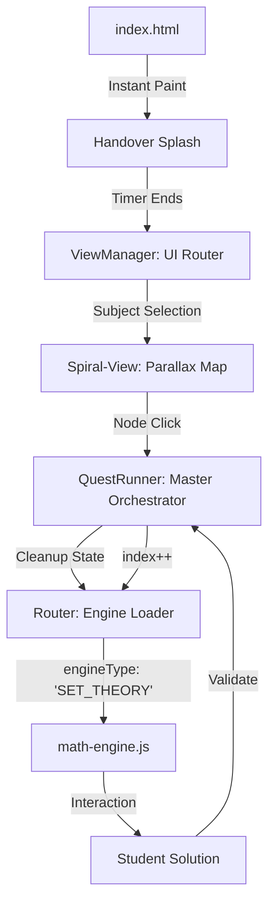

***

# 🇺🇬 Manya Prep Hub: The Technical Bible
> **Primary Seven PLE Prep, Reimagined.**
> Manya is an offline-first **Game Console** built with web technologies. It uses a **Modular Actor-Director Architecture** to transform static curriculum data into immersive interactive experiences.

---

## 🧭 1. System Architecture: The "Console & Cartridge" Model

Manya operates on a **Director-Actor Pattern**. The App Shell acts as the console, and the JSON curriculum files act as the cartridges.

### The Component Hierarchy
1.  **The Stage (`index.html`):** Handles the **Seamless Handover Splash**.
2.  **The UI Switchboard (`view-manager.js`):** Manages high-level navigation (`home`, `library`, `spiral`).
3.  **The Master Orchestrator (`quest-runner.js`):** The "Director" of every lesson. It manages the HUD, progress, and the **Cleanup Protocol**.
4.  **The Universal Router (`router.js`):** The switchboard that dynamically `import()`s engines based on the `engineType` tag.
5.  **The Actors (`engines/`):** 27+ specialized JS modules that handle specific interactions.

### High-Level Logic Flow


---

## 📑 2. The Specialized Engine Registry (All 24+ Engines)

Every engine exports two core methods: `renderStudy` (reading/tutorial) and `renderLabeling` (interactive/quizzing).

### 📐 Math Engines (`math-engines/`)
1.  **`set-theory-engine.js` (v36.0)**: Our flagship math actor.
    *   **Logic:** Algebraic Interpreter. It parses strings like `30 - w`, replaces variables with solved values, and calculates results via a safe JS evaluator.
    *   **Visuals:** Uses an offscreen `tempCanvas` for **Atomic Masking**, allowing precise shading of intersections (Union, Complement, etc.) without color bleeding.
    *   **Mobile-Safe:** Automatically re-aligns set labels to the top-center on narrow screens to prevent clipping.
2.  **`set-classifier-engine.js`**: A conceptual physics simulator. 
    *   **Finite sets** bounce inside a wooden "Kraal" or jar. 
    *   **Infinite sets** flow through an "Infinity Portal" that wraps around screen edges.
3.  **`subset-game-engine.js`**: Drag-and-drop combinatorial logic. Student finds all $2^n$ combinations by filling boxes.
4.  **`binary-generator-engine.js`**: Visualizes base-2 math as a power plant where adding "energy nodes" doubles the output.
5.  **`pizza-game-engine.js`**: Teaches Proper Subsets ($2^n - 1$). Students tap ingredients, but one "empty" combination is always excluded.
6.  **`venn-prob-engine.js`**: Splitscreen logic. Left side is a Venn diagram; right side is a fraction builder for probability.
7.  **`venn-spotlight-engine.js`**: Tap-to-shade quiz engine. Validates region clicks against complex notation like $(A \cap B)'$.
8.  **`set-study-engine.js`**: Procedural animated slides for mapping diagrams and power set trees.

### 🌍 SST Engines (`sst-engines/`)
9.  **`universal-globe-engine.js`**: Powered by `d3.js` and `topojson`.
    *   **Puzzle Mode:** Students drag 2D country silhouettes onto a 3D orthographic sphere. Uses `d3.geoDistance` to validate coordinates within 0.5 degrees.
    *   **Time Traveller:** Draws longitudes and handles globe rotation math to teach GMT time differences ($15^\circ = 1$ hour).

### 🧬 Science Engines (`science-engines/`)
10. **`3D-skeleton-engine.js`**: Wraps Google’s `<model-viewer>`. Places HTML "hotspots" on exact 3D vector coordinates. Clicking a pin orbits the camera to that specific bone.
11. **`procedural-canvas-engine.js`**: 2D drawing engine. Used for "Muscle Action" where sliders calculate joint flexion and procedurally swell bicep curves via Bezier math.
12. **`image-hotspots-engine.js`**: Labeling engine for 2D diagrams using X/Y percentage coordinates.
13. **`gallery-study-engine.js`**: A premium image carousel where tapping a photo slides up a bottom-sheet with P7-specific notes.

---

## 🗣️ 3. The English Transformation: Story-Quest Architecture

Previously, English content was a "Single Big Flow" that was difficult to manage. We have successfully **Quest-ified** English, breaking Chapter 1 into 9 distinct "Atomic Nodes."

### How the English Flow was changed:
*   **From "Mega-JSON":** We took one giant file and "chopped" it into tactical files (e.g., `01_kickoff.json`, `05_village_arrival.json`).
*   **The Master Integration:** The English runner was retired. All English logic now runs inside the **Master Quest Runner**, ensuring a unified UI (Classic Header/Footer) across all four subjects.
*   **The Vault System:** We moved all dictionaries and grammar formulas into the `/vault/` folder. This allows a Quest to call a rule via `referencePath`, ensuring the student can review a rule at any time.

### The English Specialized Engines:
14. **`chat_engine.js`**: Implements a typewriter dialogue system with "Character Avatars." Supports multi-speaker logic (Manya, Polly, Kiki).
15. **`english_rule_master.js`**: The most advanced instructional engine. Renders glowing chalkboard formulas. Features **iOS-style Segmented Controls** to toggle between "Example A" (Singular) and "Example B" (Plural).
16. **`syntax-architect.js`**: A drag-and-drop word-bank engine. Students physically build sentences. Includes a `wrongQueue` logic that forces students to retry failed sentences at the end of the lesson.
17. **`functional_composer.js`**: A simulator for letter/email writing. Renders a blank "paper" with dashed drop-slots for address, salutation, and body.
18. **`deep_reader.js`**: A splitscreen comprehension engine. The top half pins the passage (Story, Poem, Table, or Graph); the bottom half is an interactive quiz.
19. **`game-grammar-maze.js`**: A 2D tile-based game. Student uses a D-Pad to move Manya through a jungle, dodging tigers to reach the correct answer gate.
20. **`game-harvest-engine.js`**: A high-speed reflex game using `requestAnimationFrame`. Students catch falling fruit (Needle-sharp 2D graphics) into a basket, sorting Nouns from Verbs.
21. **`game-memory-match.js`**: A 3D CSS card-flipping engine for matching synonyms or tense pairs (e.g., *Go* $\rightarrow$ *Went*).
22. **`game-sentence-train.js`**: A sequence engine. Words attach as train carriages. If the syntax is correct, the train "Toots" and drives off-screen.
23. **`game-hangman.js`**: A procedurally drawn hangman. Every incorrect guess draws a new SVG line for the gallows.
24. **`game-wordgrid.js`**: A procedural 8x8 Word Search. Uses touch-raycasting to detect horizontal, vertical, and diagonal word selections.
25. **`morph_game.js`**: Uses coordinate-calculation math to animate word-tenses "flying" across the screen to transform from Direct to Indirect speech.

---

## ⚙️ 4. The Content Pipeline: Excel to UI

Manya uses a **Zero-Manual-Code** content pipeline.

### Step 1: The Excel DB
Teachers author content in standard Excel files (`math_bank.xlsx`).
| Topic | Interaction | Correct Answer | Engine |
|---|---|---|---|
| Sets | DIAGRAM_FILL | 12 | SET_THEORY |

### Step 2: The JSON Export
Python/Node scripts convert Excel rows into Atomic JSON files stored in specific folders (e.g., `content/math/set_theory/quest_04/04-001.json`).

### Step 3: The Sync (`sync-curriculum.js`)
Running `node sync-curriculum.js` in VS Code terminal:
1.  Crawls the directory structure.
2.  Auto-calculates `practiceCount` by counting numbered files.
3.  Auto-detects Rules and Dictionaries in the `/vault/` folders.
4.  Generates the `curriculum.json` manifest.

### Step 4: The Library View
The `library-view.js` reads the manifest and builds the accordion UI and the 5-column practice grid instantly.

---

## 🎨 5. Atmospheric & Visual Identity

*   **Infinite Forest Engine:** 850px tiles overlapped by -40px with a `-webkit-mask-image` feathered edge.
*   **The Director Engine:** Background cycle every 30 seconds.
    *   **Day:** `saturate(1.3)` filter + **Vertical Needle Rain** particles (tilted 15 degrees).
    *   **Night:** `brightness(0.6)` filter + **Moonlight God-Rays** + **Bioluminescent Fireflies**.
*   **Full-Coverage Rain:** Spawns drops from `-30%` off-screen to ensure the 15-degree slant covers the bottom-left corner of the phone.

---

## 🔊 6. The Audio Manager
*   **Ambient Fading:** Crossfades birds (Day) to crickets (Night) over 2.5 seconds.
*   **Validation SFX:** Uses `playSFX` to provide tactile feedback for clicks, toots, and correct answers.
*   **Safety Clamping:** Clamps `audio.volume` between $0.0$ and $1.0$ to prevent browser crashes (`IndexSizeError`).

---

## 📂 7. Directory Structure Map

```text
├── index.html                 # PWA Entry & Seamless Splash Logic
├── manifest.json              # Home screen icon & Startup theme
├── curriculum.json            # Auto-generated UI database
│
├── app-shell/                 # CORE LOGIC
│   ├── js/
│   │   ├── view-manager.js    # UI State Switcher (Fullscreen Mode)
│   │   ├── quest-runner.js    # Master Director (Cleanup Logic)
│   │   ├── router.js          # Switchboard -> 27+ Engine Modules
│   │   ├── audio-manager.js   # Atmosphere & SFX Service
│   │   ├── sync-curriculum.js # Node script for folder-to-json automation
│   │   └── engines/           # THE 27 INTERACTIVE MODULES
│   └── css/
│       ├── style.css          # PWA HUD (Glassmorphism)
│       └── spiral.css         # Game World Visuals (Needle Rain, Snow, Night)
│
├── content/                   # THE CURRICULUM VAULT
│   ├── math/                  # Sets, Algebra, Probability
│   ├── science/               # Human Body, 3D Hotspots
│   └── english/               # Stories & /vault/ Reference Rules
│
└── assets/                    # STATIC ASSETS
    ├── images/                 # Map tiles, Avatars, Island graphics
    ├── shared/                # Mascot MP4, Fur Poster, Global SFX
    └── fonts/                 # Nunito, Plus Jakarta Sans
```

---

## 🚀 8. Next Steps: The Roadmap

### Phase 1: Database Fetcher (Q2 2026)
Replacing the `QuestFactory` local fetch with a **Supabase/Firebase** bridge. This will allow the "Daily Path" to pull questions from a cloud database based on the student's mastery level.

### Phase 2: The Mistake Bucket Engine
Implementing an automated remedial system. Every failed question is added to a `mistake_bucket` in `localStorage`. The app will inject these into the student's "Daily Adventure" until they are answered correctly three times in a row.

### Phase 3: Parent Achievement Portal
Background sync of XP and Accuracy data to a cloud dashboard where parents in Uganda can monitor their child's PLE prep performance in real-time.

***
*Developed for Manya Prep Hub — Uganda's Gold Standard for Primary Seven Learning.*