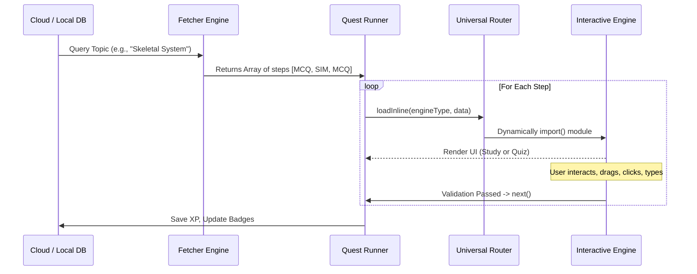
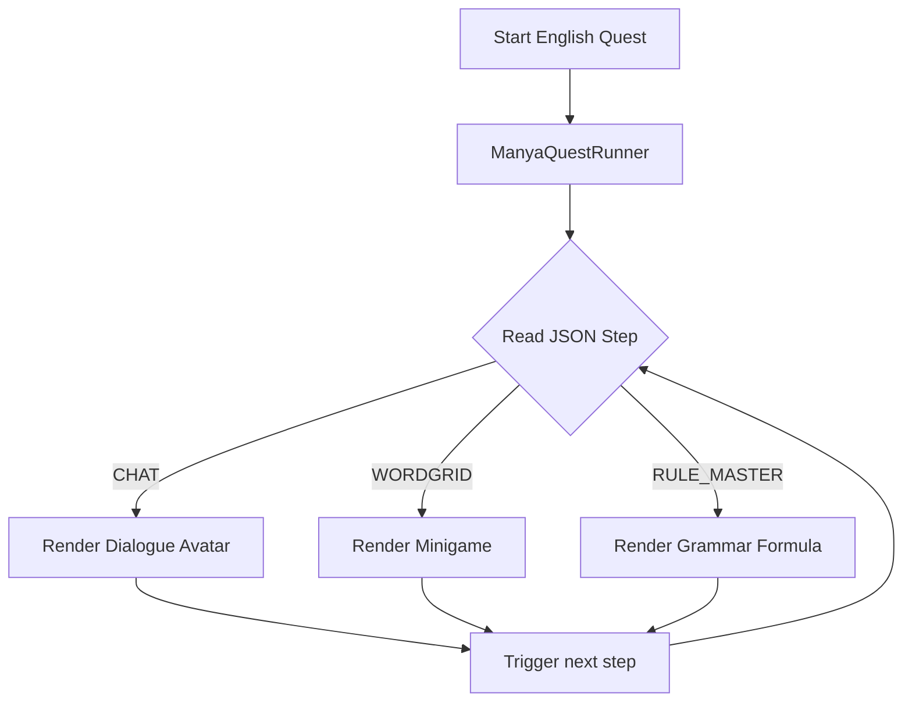

***

#  Manya Prep Hub (PWA)
> **Primary Seven PLE Prep, Reimagined.**
> A high-end, gamified, offline-first Progressive Web App (PWA) built to help Ugandan students master the National Syllabus. It uses a dynamic Director-Actor architecture to render 24+ procedural game engines from structured data.

[](#) [](#) [](#) [](#)

---

## 📖 Table of Contents
1. [System Architecture & The Lifecycle](#1-system-architecture--the-lifecycle)
2. [The Core Shell (File-by-File Breakdown)](#2-the-core-shell-file-by-file-breakdown)
3.[📚 The English Exception: Story-Line Architecture](#3--the-english-exception-story-line-architecture)
4.[The Specialized Engine Registry (All 24 Engines)](#4-the-specialized-engine-registry-all-24-engines)
5. [The Content Pipeline & The DB Fetcher (Next Phase)](#5-the-content-pipeline--the-db-fetcher-next-phase)
6.[Atmospheric & Visual Identity](#6-atmospheric--visual-identity)
7. [Gamification: Rewards, Badges & Rankings](#7-gamification-rewards-badges--rankings)
8. [Directory Structure Map](#8-directory-structure-map)

---

## 1. System Architecture & The Lifecycle

Manya Prep Hub completely abandons hardcoded UI screens. Instead, it acts as a **"Game Console"** that loads "Cartridges" (Data arrays). 

### How the App Works (The Universal Flow)


---

## 2. The Core Shell (File-by-File Breakdown)
These files inside `app-shell/` form the immutable skeleton of the PWA.

*   `sw.js`: **The Service Worker.** Uses a Cache-First strategy. It aggressively caches the App Shell (`index.html`, `style.css`), the Core Engines, and large external libraries (`d3.js`, `model-viewer.js`, `draco` decoders).
*   `view-manager.js`: **The Top-Level UI Router.** Toggles the app between `home` (The Hub), `library` (Self-Study Mode), `spiral` (The Winding Map), `profile`, and `rankings`.
*   `router.js`: **The Universal Switchboard.** Contains the `ENGINE_REGISTRY`. It takes an `engineType` string (e.g., `"3D_SKELETON"`) and dynamically `import()`s the exact JS file. This ensures the app is lightning fast and only loads the code needed for the current question.
*   `audio-manager.js`: **The "Juice" Layer.** Handles ambient crossfading (e.g., day vs. night nature sounds), UI SFX, and weather audio. Automatically clamps volume.
*   `quest-runner.js`: **The Standard Wrapper UI.** Renders the classic white header, the purple/pink progress bar, and the global "Continue" button for Math, Science, and SST.
*   `quest-factory.js`: Currently builds 4-step quests from local JSONs. *(Slated to be replaced by the DB Fetcher Engine in Phase 2)*.

---

## 3. 📚 The English Exception: Story-Line Architecture

Unlike Math or Science which rely on standard Question -> Answer flows, **English is treated as a linear, narrative-driven RPG**. 

To achieve this, English has its own dedicated orchestrator: `app-shell/js/engines/english-engines/quest_runner.js` (aka `ManyaQuestRunner`).

### The English Flow Diagram


### The Vault Reference System
To prevent duplicating grammar rules across hundreds of JSONs, English uses a **Vault Reference System**.
If the JSON contains a `referencePath`, the Runner pauses, fetches the external JSON from the `/quest_10_vault/`, and injects it seamlessly into the story.

**Example English JSON Manifest:**
```json
{
  "questId": "ENG-C1-Q1",
  "engineType": "QUEST_RUNNER",
  "steps":[
    {
      "id": "q1-chat-01",
      "engineType": "CHAT",
      "data": { "speaker": "manya", "text": "Waddle! The term is COMMENCING!" }
    },
    {
      "id": "q1-dictionary",
      "engineType": "ENGLISH_RULE_MASTER",
      "referencePath": "../quest_10_vault/dict_holidays.json" 
    }
  ]
}
```
*Notice how the flow seamlessly transitions from a character talking directly into a dictionary flashcard—all controlled by one JSON file.*

---

## 4. The Specialized Engine Registry (All 24 Engines)

We have built 24 distinct interactive engines. Every engine exports at least two core methods: `renderStudy` (for learning/reading) and `renderLabeling` (for quizzing/interacting).

### 📐 Math Engines (`math-engines/`)
1.  **`set-theory-engine.js`**: Procedural canvas drawing of Venn diagrams. Uses atomic masking to accurately shade intersections. Calculates algebraic expressions (e.g., 30-x).
2.  **`set-classifier-engine.js`**: Physics/particle engine. Particles bounce inside a bounded box (Finite) or loop infinitely across the screen (Infinite).
3.  **`subset-game-engine.js`**: Drag-and-drop items into a box to find combinations, or tap to color stripes on a flag. Teaches 2^n logic.
4.  **`binary-generator-engine.js`**: Visualizes exponents as a "Power Plant". Add orbiting electrons to double the output.
5.  **`pizza-game-engine.js`**: Visualizes Proper Subsets. Tap ingredients onto a pizza to match a target number.
6.  **`venn-prob-engine.js`**: Split-screen geometry. Drag "people chips" into Venn regions based on a story, then calculate probability fractions.
7.  **`venn-spotlight-engine.js`**: Quiz engine. Tap regions of a Venn diagram to shade them, validating against complex set notation (e.g., A U B').
8.  **`set-study-engine.js`**: Procedural educational slides (animated mapping diagrams, power set trees).

### 🌍 SST Engines (`sst-engines/`)
9.  **`universal-globe-engine.js`**: The heaviest rendering engine, powered by `d3.js` and `topojson`. Renders an interactive 3D orthographic globe mapped with real GPS coordinates. Features *Puzzle Mode* (drag countries to coordinates) and *Time Traveller Mode* (draws longitudes to teach GMT time math).

### 🧬 Science Engines (`science-engines/` & root)
10. **`3D-skeleton-engine.js`**: Wraps Google's `<model-viewer>`. Loads Draco-compressed `.glb` files. Parses JSON to place HTML "hotspots" (pins) on exact 3D vector coordinates. Clicking a pin orbits the camera.
11. **`procedural-canvas-engine.js`**: 2D math-based drawing engine. Used for "Antagonistic Muscles" (sliders calculate joint flexion, procedurally swelling the Bicep bezier curves).
12. **`image-hotspots-engine.js`**: Renders pulsing pins on static 2D images (X/Y percentages) for labeling quizzes where 3D is unnecessary.
13. **`gallery-study-engine.js`**: A slick image gallery. Tapping the image slides up a bottom-sheet containing reading notes.

### 🗣️ English Engines (`english-engines/`)
14. **`chat_engine.js`**: Story dialogue with typewriter effect. Dynamically loads avatars (Manya, Polly, Kiki).
15. **`english_rule_master.js`**: Renders chalkboard flashcards with grammar formulas (e.g., Active -> Passive).
16. **`syntax-architect.js`**: Drag-and-drop word bank to build valid P7 grammatical sentences.
17. **`functional_composer.js`**: Letter/email simulator. Renders a blank "paper" with absolute-positioned dashed slots for dragged words.
18. **`deep_reader.js`**: Splits screen: Top half holds long-form text/poems; bottom half holds interactive MCQs.
19. **`game-grammar-maze.js`**: 2D tile-based game. Use a D-Pad to navigate a grid, dodging tigers/snakes to reach the correct grammatical answer.
20. **`game-harvest-engine.js`**: Reflex game. Words fall from the sky. Move a basket to catch words matching the correct category (Noun vs Verb).
21. **`game-memory-match.js`**: 3D CSS card-flipping game for matching synonyms/tenses.
22. **`game-sentence-train.js`**: Sequence game. Click words to attach them as train carriages. Drives off-screen if syntax is correct.
23. **`game-hangman.js`**: Classic hangman. Draws the gallows procedurally using DOM elements.
24. **`game-wordgrid.js`**: Procedural Word Search. Generates an 8x8 grid and handles touch-drag raycasting to select hidden words.
25. **`morph_game.js`**: High-end DOM animation. Moving a slider calculates word coordinates and animates them flying across the screen to morph tenses.

### 📚 General/Shared Engines
26. **`mcq-standalone.js`**: Clean, universal multiple-choice engine with instant feedback and point awarding.
27. **`reader-study-engine.js`**: Educational engine parsing JSON into clean UI components (bullet lists, comparison tables, warning boxes).

---

## 5. The Content Pipeline & The DB Fetcher (Next Phase)

Currently, content is heavily reliant on static JSON files. **The upcoming phase is building the Database Fetcher Engine.**

### The Excel Database Schema
If you look at the raw Excel files (`ple-science.xlsx`, `math_p7_question_bank.xlsx`), you will notice a specific schema. We have standard `MCQ` questions, and we have `SIM` (Simulation) questions:

| QuestID | Topic | Question_Type | Engine_Type | File_Path |
| :--- | :--- | :--- | :--- | :--- |
| SCI-01 | Joints | `MCQ` | null | null |
| SCI-02 | Joints | `SIM` | 3D_SKELETON | `/content/science/.../elbow_3d.json` |

### How the Fetcher Engine Will Work
The Fetcher Engine will act as the bridge between the Cloud DB/Excel and the Quest Runner.
1. The App requests a 10-question daily quest for "Science: Joints".
2. The **Fetcher** queries the DB.
3. If it pulls an `MCQ`, it formats it into JSON on the fly and assigns it to `mcq-standalone.js`.
4. If it pulls a `SIM`, it reads the `File_Path` reference in the database, fetches that specific JSON file from the `/content/` directory, and adds it to the queue.
5. **Result:** The Quest Runner receives a seamless array combining standard multiple-choice questions with high-end 3D simulations.

---

## 6. Atmospheric & Visual Identity

We use hardware-accelerated CSS to ensure 60fps on low-end Androids.

*   **The Infinite Fur Splash (`index.html`):** The app loads a static purple fur background (`manifest.json`) which perfectly matches the first frame of the HD Blinking Mascot Video. The video is scaled to `1.15x` to hide any AI-generator watermarks in the corners.
*   **The Seamless Spiral Map (`spiral.css`):** 850px high map tiles overlapping by `-40px`. An SVG mask blends the edges seamlessly into an infinite vertical world.
*   **The Weather Engine (`spiral-view.js`):** Injects CSS-animated particles based on the subject: Fluffy Snow (Math), Slanted Rain (Science), Dust Motes (SST).
*   **The 30s Day/Night Director:** Toggles Day/Night modes, applying deep blue multiply filters, revealing bioluminescent fireflies, and triggering shooting star animations.
*   **The Library View (`library-view.js`):** Acts as the "Self-Study Mode", automatically parsing `curriculum-master.json` to generate an accordion UI of all available topics, separated into "Study Material" and "Practice Questions".

---

## 7. Gamification: Rewards, Badges & Rankings

To maximize student retention, the next development phase includes rolling out the global state management for the Gamification layer.

*   **Coins & XP:** Every correct interaction in the `MCQ_STANDALONE` or Game Engines awards `manya_points` (tracked via `localStorage`, syncing to the DB).
*   **Dynamic Badges:** Awarding visual achievements for milestones (e.g., "10 Days Streak", "Master of Set Theory").
*   **Rankings View (`views/rankings-view.js`):** A leaderboard system comparing the student's XP globally against other P7 students in Uganda, driving competitive learning.
*   **Profile View (`views/profile-view.js`):** A dashboard tracking accuracy percentages across Math, Science, SST, and English.

---

## 8. Directory Structure Map

```text
├── index.html                 # PWA Entry point, Video Splash, loads Hub
├── manifest.json              # PWA manifest (icons, colors, standalone)
├── curriculum-master.json     # Auto-generated manifest for Library UI
│
├── app-shell/                 # CORE APPLICATION LOGIC
│   ├── js/
│   │   ├── app.js             # Service Worker registration
│   │   ├── view-manager.js    # UI Router (Home, Spiral, Library, Profile)
│   │   ├── quest-runner.js    # Global Orchestrator (Math, Science, SST)
│   │   ├── quest-factory.js   # Builds quest arrays (Future DB Fetcher)
│   │   ├── router.js          # Switchboard -> Imports Engine Modules
│   │   ├── audio-manager.js   # BGM, SFX, Day/Night audio transitions
│   │   ├── sync-curriculum.js # Node script: Crawls /content, builds Library
│   │   │
│   │   ├── engines/           # THE 27 INTERACTIVE MODULES
│   │   │   ├── math-engines/  # Sets, Subsets, Binary, Pizza, Venn
│   │   │   ├── sst-engines/   # Universal D3 Globe Engine
│   │   │   ├── english-engines/# Story Runner, Chat, Minigames, Syntax...
│   │   │   └── ...            # 3D Skeleton, Image Hotspots, Readers
│   │   │
│   │   └── lib/               # Offline dependencies
│   │       ├── d3.v7.min.js   # Used by Globe Engine
│   │       ├── topojson.min   # Used by Globe Engine (Map Data)
│   │       ├── compromise.js  # NLP Library (English specific tasks)
│   │       └── model-viewer   # WebGL wrapper for 3D Models
│   │
│   └── views/                 # MAIN UI SCREENS
│       ├── home-view.js       # The Hub (Daily goals, Subject selector)
│       ├── spiral-view.js     # The Map (Parallax, Weather, Path rendering)
│       ├── library-view.js    # Self-Study (Reads curriculum-master.json)
│       ├── profile-view.js    # User stats / Badges (Roadmap)
│       └── rankings-view.js   # Leaderboards (Roadmap)
│
├── content/                   # JSON DATA LAYER & EXCEL BANKS
│   ├── math/                  # Set Theory, Subsets. Includes Excel DB.
│   ├── science/               # Human Body, 3D Hotspot mappings.
│   ├── sst/                   # Geography coords, Time calculations.
│   └── english/               # Narratives. Includes /quest_10_vault/ for rules.
│
└── assets/                    # STATIC MEDIA
    ├── icons/                 # Map tiles, avatars, UI graphics
    ├── shared/                # Ambient MP3s, Mascot MP4s, Draco Decoders
    ├── science/               # .glb 3D models (compressed)
    ├── fonts/                 # Plus Jakarta Sans (Local fonts)
    └── sst/                   # countries-50m.json (TopoJSON data)
```
