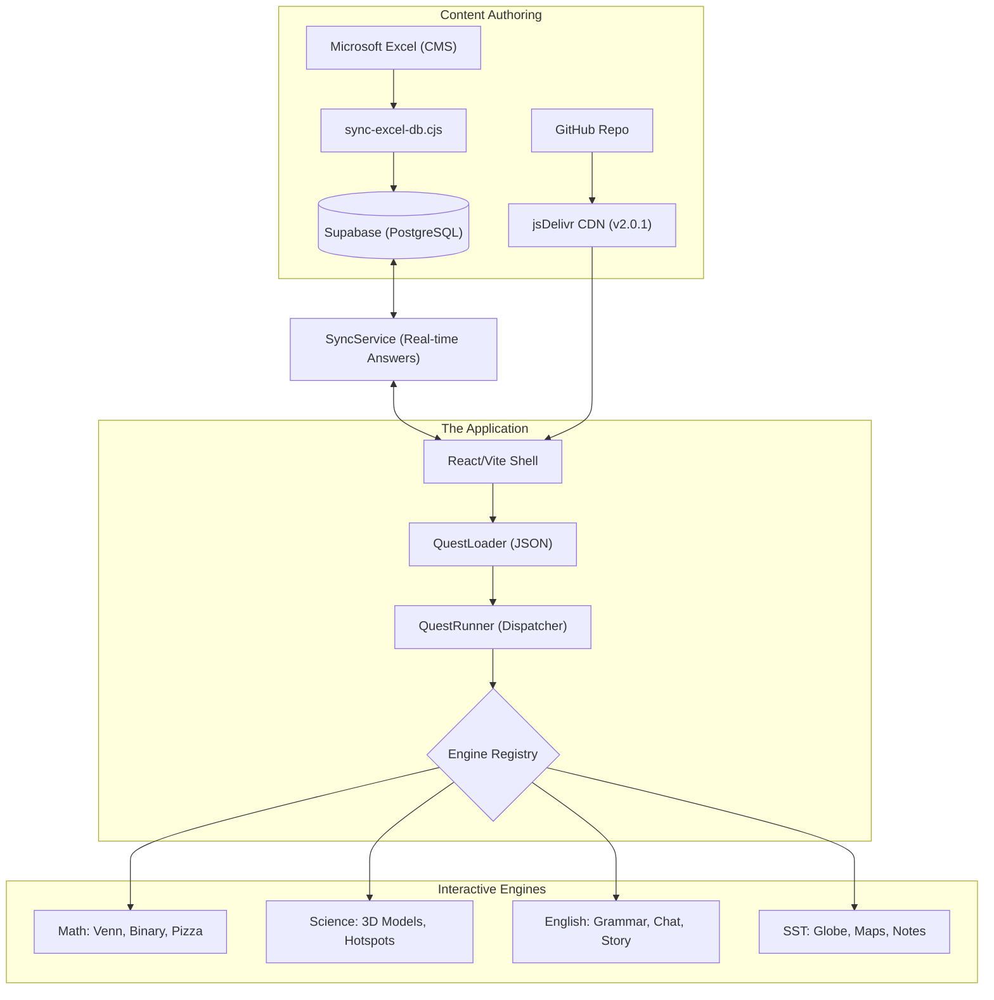

# 🚀 Manya Prep Hub (v2.0.1)

Welcome to the **Manya Prep Hub** master documentation. This repository contains a state-of-the-art interactive education platform designed for students in **Uganda** preparing for their **Primary Leaving Examinations (PLE)**.

Manya is more than just a quiz app; it is an **Adaptive Interactive Orchestrator** that combines character-driven storytelling with deep pedagogical engines in Math, English, Science, and Social Studies.

---

## 🏗️ High-Level Architecture

Manya uses a decoupled "Engine" architecture where the UI shell is independent of the curriculum logic.



---

## 🛠️ Technical Stack

| Category | Technology | Purpose |
| :--- | :--- | :--- |
| **Core** | React 19, Vite 6 | Library and Build Tooling |
| **State** | Redux Toolkit (RTK) | Global User, Audio, and UI State |
| **Database** | Supabase | Master Quest Data, Answer Logs, Achievements |
| **Animation** | Framer Motion | Fluid transitions and mascot animations |
| **Styling** | Tailwind CSS / CSS Modules | Premium "Adventure" Design System |
| **Visualization** | D3.js, Topojson | Mathematical diagrams and Geographic maps |
| **Offline** | Vite PWA / Workbox | Full curriculum caching and offline resilience |
| **Deployment** | GitHub / jsDelivr | Versioned Remote Asset Hosting |

---

## 🧠 The Engine System (`QuestRunner`)

The [QuestRunner](file:///d:/manya_app/manya-react/src/components/QuestRunner.jsx) is the central orchestration hub of the platform. It handles the lifecycle of a "Quest" (a collection of interactive steps).

### 1. The Dispatcher Model
Manya doesn't hardcode curriculum. The [ENGINE_REGISTRY](file:///d:/manya_app/manya-react/src/utils/engineRouter.js) maps metadata flags from the database to React components. This allows teachers to create new interactive experiences just by changing a column in a spreadsheet.

### 2. Supported Engine Types
<details>
<summary><b>Click to expand Engine Catalog</b></summary>

- **Mathematics**:
    - `SET_THEORY`: Interactive Venn Diagram shading (D3-powered).
    - `BINARY_GAME`: Base-2 visualization and conversion modules.
    - `PIZZA_GAME`: Fractional part-of-a-whole interactive models.
    - `SUBSET_GAME`: Logical categorization of sets.
- **English**:
    - `CHAT`: Narrative-driven dialogue systems with Manya.
    - `GRAMMAR_MAZE`: Pos-tagging and word-category games.
    - `DEEP_READER`: Immersion reading modules with synchronized highlights.
    - `SENTENCE_TRAIN`: Syntactic sequence building blocks.
- **Science & SST**:
    - `3D_SKELETON`: WebGL-based anatomical and biological models.
    - `IMAGE_HOTSPOTS`: Detailed diagram exploration with pop-out notes.
    - `UNIVERSAL_GLOBE`: 3D Topojson globe for geographic synchronization.
</details>

---

## 📊 Mastery & Adaptive Learning Logic

Manya features an advanced internal AI tutor that adjusts difficulty in real-time.

### The Mastery Ladder
Each concept is tracked across a **7-state ladder** in the [masteryService](file:///d:/manya_app/manya-react/src/services/masteryService.js):
1. `new`
2. `struggling_v1`
3. `learning`
4. `ready_for_v2`
5. `struggling_v2`
6. `ready_for_v3`
7. `mastered`

### USP (Unified Scoring Protocol)
Student performance is calculated using a weighted formula:
*   **Accuracy (60%)**
*   **Time Spent (20%)**
*   **Effort/Mistakes (20%)**

### 🚨 Mercy Recaps & Psych Tracking
The [psychTracker](file:///d:/manya_app/manya-react/src/services/psychTracker.js) monitors user frustration. If a student fails a concept $N$ times consecutively, the `QuestRunner` automatically **injects a "Recap" step** (a study card or diagram) into the quest flow to prevent burnout.

---

## 🔄 The Content Pipeline (Excel CMS)

Manya's curriculum is managed by subject experts using Microsoft Excel, allowing non-developers to update the platform effortlessly.

1.  **Authoring**: Educators fill out `subject_p7_question_bank.xlsx`.
2.  **Syncing**: Running `node scripts/sync-excel-db.cjs` parses the spreadsheet and performs a high-speed **Upsert** to the Supabase tables (`questions_math`, `questions_science`, etc.).
3.  **Assets**: Running `node scripts/sync-assets.cjs` (legacy) or uploading to the GitHub CDN repository makes assets available via the **v2.0.1** jsDelivr pipeline.

---

## 🎨 Design System: "The Adventure Theme"

The UI is built on a custom design system defined in [design-tokens.css](file:///d:/manya_app/manya-react/src/styles/design-tokens.css).

### The Biome System
Each subject has its own "Biome" color and Mascot:
*   🟣 **Math (The Logic Void)**: Mascot: **Manya**
*   🟢 **Science (The Bio-Dome)**: Mascot: **Kiki**
*   🔵 **SST (The World Oasis)**: Mascot: **Polly**
*   🔴 **English (The Lexicon Grove)**: Mascot: **Zany**

### Interactive Aesthetics
- **Glossy UI**: Buttons use 3D-depth shading and vibrant HSL colors.
- **Micro-animations**: Every "Continue" press and "Gem" award is animated via Framer Motion for maximum positive reinforcement.

---

## 🚀 Specialized Build & Deployment

### Relative Path Support (`file://`)
Manya is often distributed in low-connectivity areas via USB or offline packages. The project is configured with:
*   `base: './'` in Vite.
*   `@vitejs/plugin-legacy` to generate non-module bundles.
*   Custom `remove-crossorigin` plugin to allow opening `index.html` directly from the file system.

### Running Locally
```bash
# Install dependencies
npm install

# Run dev server
npm run dev

# Build for production (Relative Paths + Legacy Support)
npm run build
```

---

> [!NOTE]
> This project is intellectual property of the Manya Team. For database credentials or CDN access, please refer to the internal `.env` documentation (not committed to version control).

> [!TIP]
> When adding a new interactive engine, ensure it implements the `onComplete` and `onResult` props to stay compatible with the Mastery/USP tracking system.
