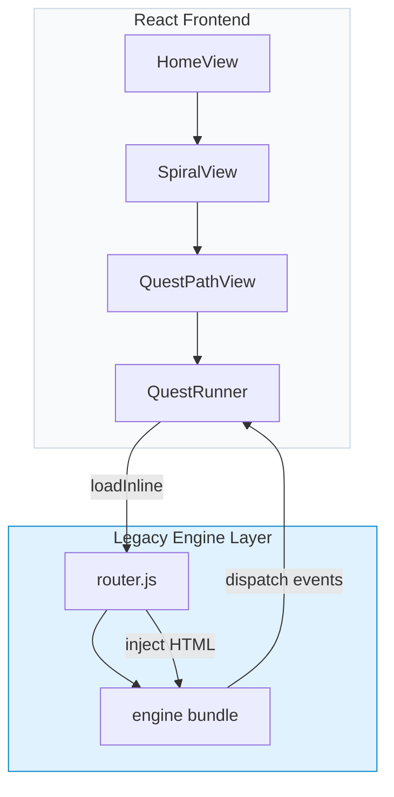
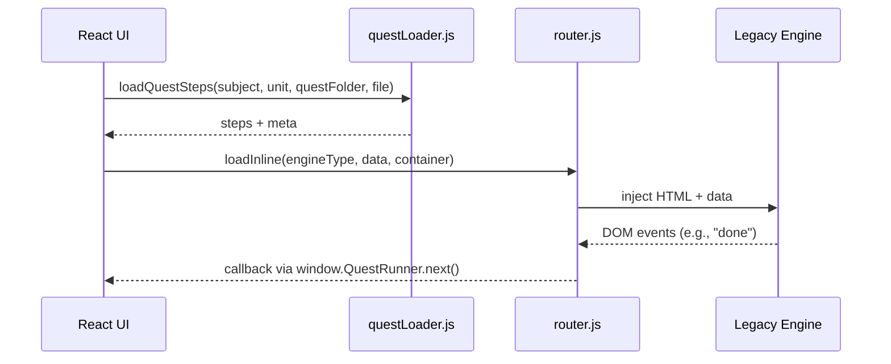

# Manya App

## Project Overview & Big Picture

Manya is a **gamified learning platform** that lets users explore educational content through a series of interactive quests.  The core experience is the **Spiral Quest** – a world‑map view where each node represents a learning unit (e.g., a math topic, a science concept).  Users tap a node to launch a **legacy engine** (vanilla JavaScript) that presents the actual activity (MCQ, puzzle, study view, etc.).

The app is built with **React + Vite** for a fast development experience, but it still relies on a collection of **legacy engines** that were originally written as standalone HTML/JS bundles.  The `QuestRunner` component acts as a bridge, loading those engines on‑demand inside a plain `<div>`.

## Directory Structure (high‑level)

```
├─ public/                     # static assets & legacy engine bundle
│   └─ legacy/                # vanilla JS engines & router
│       ├─ js/                # engine source files
│       └─ router.js          # loads an engine into a container
├─ src/                        # React source
│   ├─ components/            # UI components (QuestRunner, etc.)
│   ├─ views/                 # page‑level views (Home, Spiral, QuestPath)
│   ├─ utils/                 # helpers (questLoader, etc.)
│   ├─ styles/                # CSS (global, engine specific)
│   └─ App.jsx                # top‑level layout
├─ curriculum‑master.json      # master data for all subjects/units
├─ package.json                # npm scripts & dependencies
└─ README.md                  # **this file**
```

## Setup & Development

```bash
# Clone the repo (already done in your workspace)
# Install dependencies
npm install

# Run the development server
npm run dev   # Vite dev server at http://localhost:5173

# Build for production
npm run build
```

> **Note**: The app uses a PWA manifest (`pwa-assets.config.js`) and a service worker (`public/legacy/sw.js`).  When developing locally, the service worker may cache old assets – you can disable it in Chrome DevTools → Application → Service Workers → *Unregister*.

## Architecture Diagram



## Data Flow Diagram



## Engine Architecture & Detailed Explanations

Manya ships **four engine families** under `public/legacy/js/engines`:

| Family | Example Engines | Purpose |
|--------|----------------|---------|
| **Math** | `set-theory-engine.js`, `venn-spotlight-engine.js`, `binary-generator-engine.js` | Interactive puzzles, set visualisations, MCQs |
| **Science** | `gallery-study-engine.js`, `image-hotspots-engine.js` | Image‑based study, hotspot quizzes |
| **SST** (Social‑Science‑Tech) | `mcq-standalone.js`, `reader-study-engine.js` | Classic multiple‑choice & reading activities |
| **English** | `english-engines/*` | Grammar/typing chat engines |

Each engine follows a tiny contract:
1. **Exports** a `run(data, container)` function (via the legacy router).
2. **Calls** `window.QuestRunner.next()` when the activity is finished.
3. **Optionally** disables the footer button via `window.QuestRunner.disableButton()`.

The **router** (`public/legacy/router.js`) dynamically imports the engine file and calls its `run` method, passing the JSON payload from `curriculum‑master.json`.

### Adding a New Engine
1. Create a new file under the appropriate family folder (e.g., `public/legacy/js/engines/math-engines/my-new-engine.js`).
2. Export a `run(data, container)` function that renders UI into `container`.
3. Register the engine name in `router.js` (add to the `engineMap`).
4. Add a new entry to `curriculum‑master.json` with `engineType: "MY_NEW_ENGINE"`.
5. Optionally add CSS rules in `src/styles/engines.css`.

## Spiral Quest & Question Fetcher
The **SpiralView** component loads the curriculum JSON, builds a linear list of nodes, and renders a scrollable world map.  When a node is tapped, it navigates to `QuestPathView` which then hands control to `QuestRunner`.

Your friend’s *question fetcher* can simply read `curriculum‑master.json` (or the filtered subset for a subject) and pull the `resources` array for a given quest.  Example (Node.js):

```js
const fetch = require('node-fetch');
(async () => {
  const res = await fetch('http://localhost:5173/curriculum-master.json');
  const data = await res.json();
  const subject = data.math.units.flatMap(u => u.quests)
    .find(q => q.folder === 'quest_01_finite_infinite_sets');
  console.log('Resources for', subject.title, ':', subject.resources);
})();
```

## Diagrams (Architecture & Data Flow)
- The Mermaid diagrams above are rendered automatically on GitHub and most markdown viewers.
- For a visual UI mock‑up, you can generate an image with the `generate_image` tool (optional).

## Final Notes
- **Styling**: All engine‑specific styles live in `src/styles/engines.css`.  When adding a new engine, add a CSS block prefixed with `.my-engine‑class { … }`.
- **State Management**: User progress (`prog_math`, `mathGems`, etc.) is stored in the Redux `user` slice and persisted via the backend (Supabase) – see the `Supabase Backend Integration` conversation for details.
- **Testing**: Run `npm run test` (if a test suite exists) to ensure the new README does not break the build.

---
*This README was generated to give a clear, premium‑looking overview of the Manya app for developers joining the project.*
